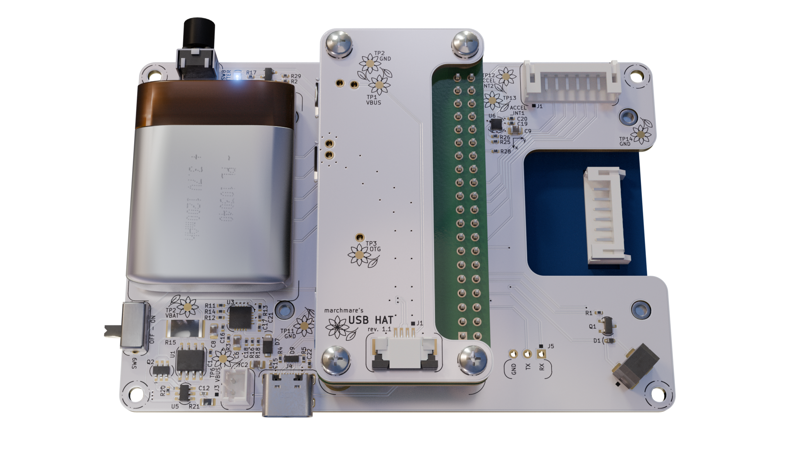

# 🌻 SnapHAT - PCB design


SnapHAT is an addon for RaspberryPi Zero 2 W serving as a handheld photo camera device.

This repository contains KiCad 9 design files for the PCBs of the SnapHAT device.
The boards' layout is prepared to be compatible with JLCPCB standard 2-layer PCB quote.

### Table of contents:

* [Features](#features)
* [Repository structure](#repository-structure)
* [Bill of Materials](#bill-of-materials)
* [RaspberryPi header connection map](#raspberrypi-header-connection-map)
* [Troubleshooting](#troubleshooting)

## Features

* 40-pin Raspberry Pi GPIO header for integration with RaspberryPi Zero 2 W
* 8-pin PH connector and mounting support for 320x240 Waveshare 18366 2.4" LCD TFT display
* Usable with ZeroCam OV5647 5MPx wide-angled 120° camera modules or same form-factor alternatives
* 1200mAh Li-Po battery support (30x40mm cell footprint, 2 pin PH connector), on-board battery charging (MCP73871) and power monitoring (INA219)
* USB-C charging and OTG connector for RaspberryPi SD card access (USB 2.0)
* USB OTG pogo-pin breakout board as Raspberry Pi HAT, accessing USB singals through pogo-pins, connected to main board via 4pin FFC cable
* 8 tactile user interface buttons (navigation and shutter)
* LIS2DW12 motion sensor for providing image orientation metadata
* passive buzzer for audio feedback
* exposed debug UART pins
* flower testpads, because joy and whimsy is in demand



## Repository structure

```
.
├─ main_board/
│   ├─ docs/
│   ├─ *.kicad_pro, *.kicad_sch, *.kicad_pcb
│   └─ README.md
├─ usb_hat/
│   ├─ docs/
│   ├─ *.kicad_pro, *.kicad_sch, *.kicad_pcb
│   └─ README.md
├─ img/
└─README.md
```

This repository contains two KiCad projects for each board:

* [**main_board**](main_board/) - SnapHAT main board with RaspberryPi socket connector and all camera device peripherals
* [**USB HAT**](usb_hat/) - USB OTG pogo-pin breakout board

Each board directory contains:

* `*.kicad_pro`, `*.kicad_sch`, `*.kicad_pcb` - KiCad 9 design files
* `docs/` - documentation outputs generated from the KiCad files - you will find BOM in CSV format and schematic PDF in there

In the root directory:
* `img/` - rendered previews of the boards and other images used by READMEs

## Bill of Materials

You can find BOMs for each board as CSV file in their respective `docs/` directories.
BOMs list PCB components, wire harness components, fasteners as well as OTS modules required to assemble the whole device. 

While designing SnapHAT, Farnell and TME were mostly taken into consideration as part vendors, however some parts need to be sourced from elsewhere (this applies mostly to OTS modules). 

Estimated component cost of the whole device is approximately 114 USD.

## RaspberryPi header connection map

Below table describes connected RaspberryPi GPIO pins and their intended function.

| Pin function              | Signal name        | GPIO (BCM) | Pin    | Pin    | GPIO (BCM) | Signal name      | Pin function                   | 
| ------------------------- | ------------------ | ---------- | ------ | ------ | ---------- | ---------------- | ------------------------------ |
| 3.3V power rail           | `+3V3`             | -          | **1**  | **2**  | -          | `+5V0`           | 5V power rail                  |
| I2C data                  | `I2C_SDA`          | 2          | **3**  | **4**  | -          | `+5V0`           | 5V power rail                  |
| I2C clock                 | `I2C_SCL`          | 3          | **5**  | **6**  | -          | `GND`            | Ground                         |
| _Not connected_           | -                  | 4          | **7**  | **8**  | 14         | `RPI_UART_TX`    | Debug UART Transmit          |
| Ground                    | `GND`              | -          | **9**  | **10** | 15         | `RPI_UART_RX`    | Debug UART Receive             |
| Menu button               | `BTN_MENU`         | 17         | **11** | **12** | 18         | `BUZZER_SIGNAL`  | Buzzer PWM                     |
| A button                  | `BTN_A`            | 27         | **13** | **14** | -          | `GND`            | Ground                         |
| B button                  | `BTN_B`            | 22         | **15** | **16** | 23         | -                | _Not connected_                |
| 3.3V power rail           | `+3V3`             | -          | **17** | **18** | 24         | `DISPLAY_RST`    | Display reset                  |
| Display SPI MOSI          | `DISPLAY_MOSI`     | 10         | **19** | **20** | -          | `GND`            | Ground                         |
| _Not connected_           | -                  | 9          | **21** | **22** | 25         | `DISPLAY_DC`     | Display Data/Command         |
| Display SPI serial clock  | `DISPLAY_SPI_SCLK` | 11         | **23** | **24** | 8          | `DISPLAY_SPI_CS` | Display SPI chip select        |
| Ground                    | `GND`              | -          | **25** | **26** | 7          | -                | _Not connected_                |
| Down button               | `BTN_D`            | 0          | **27** | **28** | 1          | -                | _Not connected_                |
| Left button               | `BTN_L`            | 5          | **29** | **30** | -          | `GND`            | Ground                         |
| Right button              | `BTN_R`            | 6          | **31** | **32** | 12         | `DISPLAY_BL`     | Display backlight PWM          |
| Up button                 | `BTN_U`            | 13         | **33** | **34** | -          | `GND`            | Ground                         |
| Low battery indicator LED | `LED_LBO`          | 19         | **35** | **36** | 16         | `LED_SHUTTER`    | Shutter activity LED indicator |
| Shutter button            | `BTN_SHUTTER`      | 26         | **37** | **38** | 20         | `ACCEL_INT1`     | Motion sensor interrupt 1      |
| Ground                    | `GND`              | -          | **39** | **40** | 21         | `ACCEL_INT2`     | Motion sensor interrupt 2      |

## Troubleshooting

Some sources noted that USB via pogo-pin connection doesn't work when Wi-Fi is enabled due to signal interference. If that's the case, RaspberryPi should be accessed through UART rather than `ssh`. 