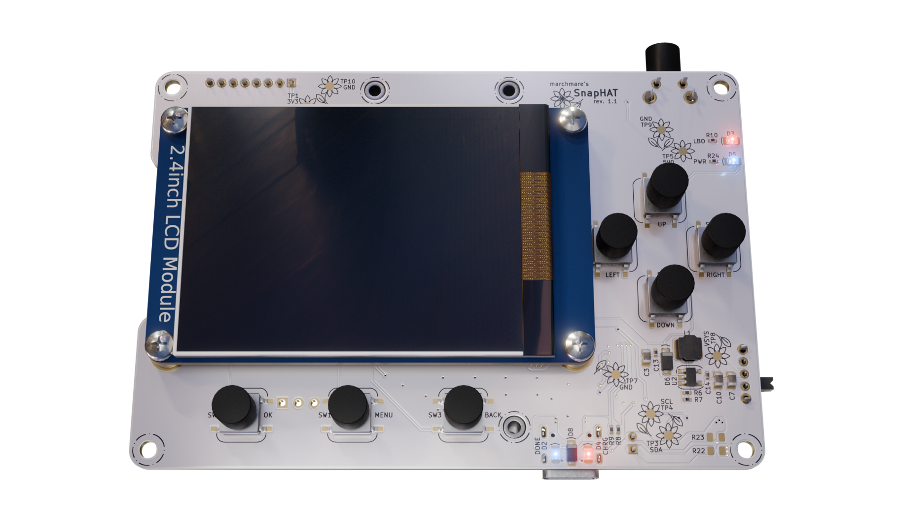

# 🌻 SnapHAT - PCB design

SnapHAT board is a HAT (or addon) for RaspberryPi Zero 2 W combining functionalities of popular RaspberryPi-compatible modules to be serving as a handheld photo camera setup.

This repository contains KiCad 9 design files for the PCB of the SnapHAT. The board's layout is prepared to be compatible with JLCPCB standard PCB quote.

### Table of contents:

* [Features](#features)
* [Repository structure](#repository-structure)
* [Bill of Materials](#bill-of-materials)

## Features

* 40-pin Raspberry Pi GPIO header (Pi Zero 2 W compatible)
* 1200mAh Li-Po battery support (30x40mm cell footprint, 2 pin PH connector)
* integrated battery charging and power monitoring
* USB-C charging and OTG connector 
* USB OTG breakout HAT (pogo-pin interface to Raspberry Pi test pads), separable via mousebites and connectable via FFC cable
* 8-pin PH connector with mounting support for 320x240 Waveshare 18366 2.4" LCD TFT display
* 8 tactile user interface buttons (navigation and shutter)
* motion sensing for automatic image orientation metadata
* passive buzzer for audio feedback
* exposed UART pins
* flower testpads, because joy and whimsy is in demand

## Repository structure

* `*.kicad_pro`, `*.kicad_sch`, `*.kicad_pcb` - KiCad 9 design files
* `docs/` - this directory contains documentation outputs generated from the KiCad files - you will find BOM in CSV format and schematic PDF in there

## Bill of Materials

Bill of Materials for PCB assembly can be found in [this CSV file](docs/snaphat_bom.csv). 

