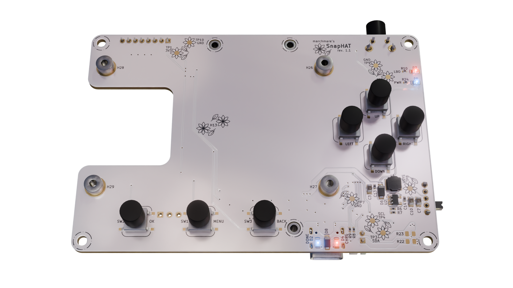
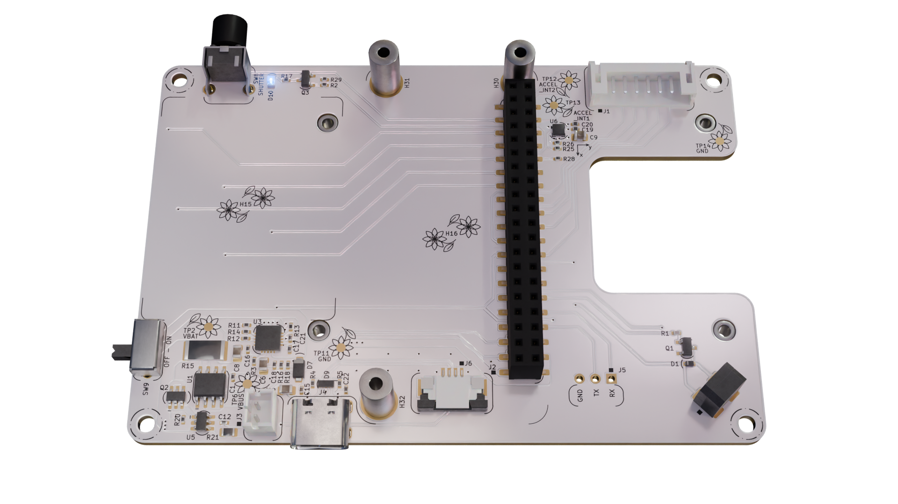

# SnapHAT main board

This directory contains design files and documentation for SnapHAT main board.

## Directory structure

```
.
└─ main_board/
   ├─ docs/
   │    ├─ *_bom.csv
   │    └─ *_schematic.pdf
   ├─ *.kicad_pro, *.kicad_sch, *.kicad_pcb
   └─ README.md
```

## Board previews



